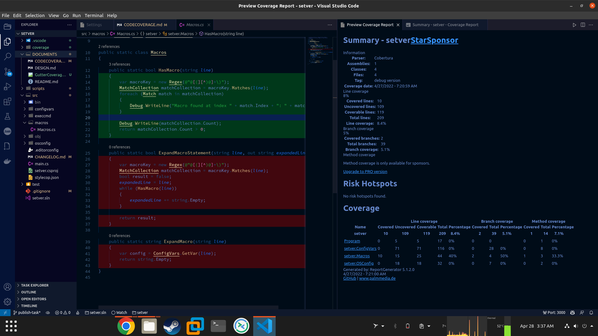
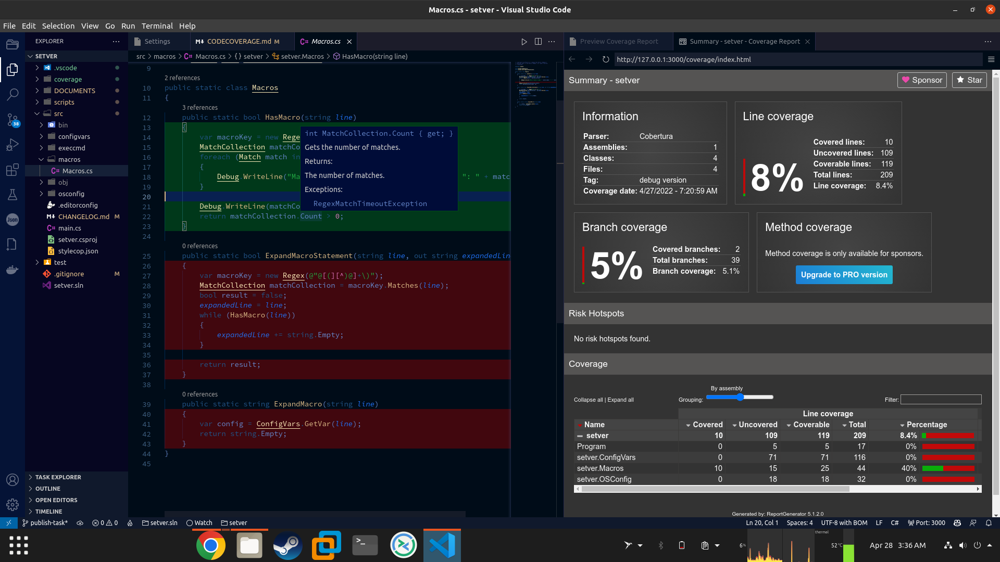

# Code Coverage

Details on how to configure VS Code to display code coverage through the use of the *Coverage Gutters* extension. The extension uses two files, **a** *coverage report* and a *coverage file*.

A *coverage report* is typically a HTML file (index.htm or index.html) that provides infomation  covered code. The report file is  only used for the `<CTRL-SHIFT-6>` `Preview Coverage Report` command.

A *coverage file* is typically an XML file better suited to machine processing. The *coverage file* is used by the *Coverage Gutters* extension to colorize the editor window.

## Requirements

Install the Coverage Gutters extension by Ryan Luker.

Extension ID:  `ryanluker.vscode-coverage-gutters`

## Configuration

The configuration has already been done for this template. If you want to setup coverage gutters for other projects, the following configuration settings should help you get started:

1) Point to the HTML coverage report. In this example the extension looks in the `coverage` folder for the file `index.html`:

   ```json
   "coverage-gutters.coverageReportFileName":
                          "coverage/**/index.html"
   ```

2) Verify that the coverage file has the right name. Here I added `coverage.cobertura.xml` since it's the coverage file generated by the `Coverlet` code coverage tool for dotnet programs:

   ```json
   {
     "coverage-gutters.coverageFileNames":
                      [
                          "coverage.cobertura.xml",
                          "lcov.info",
                          "cov.xml",
                          "coverage.xml",
                          "jacoco.xml",
                      ]
   }
   ```

3) Point to the *directory* of the coverage file. This directory is searched for one of the above filenames:

   ```json
   {
     "coverage-gutters.coverageBaseDir" : "coverage"
   }
   ```

4) To enable breakpoints while code coverage is displayed, it's necessay to display line code coverage and disable gutter code coverage:

   ```json
    {
      "coverage-gutters.showGutterCoverage": false,
      "coverage-gutters.showLineCoverage": true
    }
   ```

## Expected Results

Pressing `CTRL-SHIFT-6` opens a preview window for the *coverage report* on the side.  Pressing `CTRL-SHIFT-7` colors the lines of source code according to the *coverage file*.

Version 2.9.1 of *Coverage Gutters* shows the following:



Version 2.10.0 (future milestone) should show the report using the `Live Preview` extension by Microsoft.  This allows CSS, javascript, and links to work correctly for interactive *coverage reports*:


